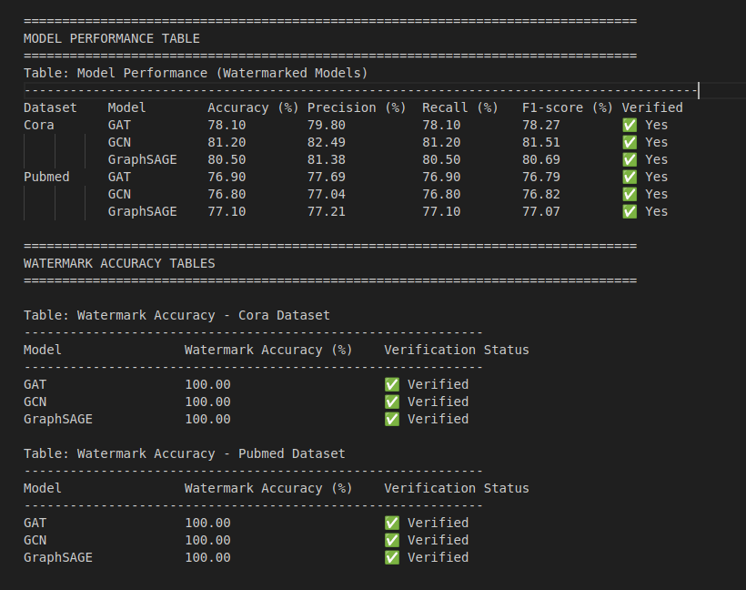

# Watermarking_GNN

This project implements Graph Neural Networks (GNN) with various models and loss functions.

## Setup

1. Clone the repository:
   ```bash
   git clone <repository-url>
   cd <project_name>

2. Create and activate a virtual environment:
   ```bash
   python -m venv <env_name>
   source <env_name>/bin/activate

3. Install Dependencies:
   ```bash
   pip install -r requirements.txt

4. Usage:
    
   a. Basic Command to run all models and datasets

   ```bash
   python main.py all
   ```

   b. Run specific model and specific dataset only

   ```bash
   python main.py --model <model_name> --dataset <dataset_name>

    | Argument       | Description                    | Options / Type                       
    |----------------|--------------------------------|---------------------------------
    | `--model`      | Model architecture to use      | `GCN`, `GAT`, `GraphSAGE`            
    | `--dataset`    | Dataset to train/evaluate on   | `Cora`, `Pubmed`  

5. Results:

   Results will be displayed in a new file named results_table.txt. Sample is presented below:

   
  

